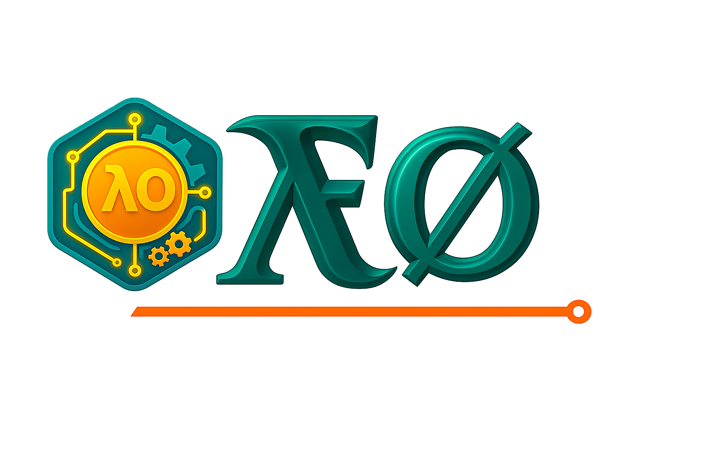

# ⚙️ IN ACTIVE DEVELOPMENT ⚙️

> [!NOTE]
> This repository is currently a **public placeholder**. 
> 
> The core code is actively being developed (or "baking") in private repositories. Once the project reaches a working, stable condition, the full source code will be published here.
> 
> Thank you for your patience! Please **Star** this repository to be notified when the code is released.

---


<p align="center">
  
</p>
<p align="center">
  <a href="https://github.com/samkrao/folang/releases">
    
  </a>
  <a href="https://github.com/samkrao/folang/blob/main/LICENSE">
    
  </a>
  <a href="https://github.com/topics/programming-language">
    
  </a>
</p>


**𝑓oλang Language** is a general purpose programming language. It is designed to "make code expressive, consistent and extensible syntax".

As the name suggests a system where Objects are at the core, while the code feels functional and flows fluently.

This idea was first developed and implemented by **samkrao@gmail.com** in **2025** and is a core part of the FoLang specification.


## License

This project uses a dual license model:

- 🧠 **Language Specification** is licensed under [Creative Commons Attribution 4.0 (CC BY 4.0)](https://creativecommons.org/licenses/by/4.0/).  
- 🧠 **Innovative language design concepts** are licensed under [Creative Commons Attribution 4.0 (CC BY 4.0)](https://creativecommons.org/licenses/by/4.0/).
- 🧠 **Novel syntax design choices in this language** are licensed under [CC BY 4.0](https://creativecommons.org/licenses/by/4.0/).  
  You may use and adapt the specification freely, but must credit the original author.

- 🧰 **All source code** (compiler, interpreter, tools) iunder the GNU General Public License v3.0 (GPLv3) see [License ](LICENSE.txt) file or at https://www.gnu.org/licenses/gpl-3.0.html..  


## Download and Install

### Binary Distribution
Official binaries can be downloaded from [Releases](https://github.com/samkrao/folang/releases).

### Install From Sources
If a binary is not available for your architecture and/or operating system:

* **Download** and install the latest Golang compiler (1.24+)
* **Download** and install MingW/GCC as mentioned in the **Dependencies** or **Requirements** section below
* Checkout the code:
  ```bash
  git clone https://github.com/samkrao/folang.git
* Install prerequisite packages:
  ```bash
  go get -u ./...
  
## Documentation
[F̷𝒐λang Document](./docs/README.md)


# Desclaimer

   If a feature is missing because,

        1. Limitation (meaning authors inability to implement) nothing more or less no other interpretations
        2. Implemented in other way or missing if so let us know we will try to incorporate if it will not become a limitation


## Dependencies or Requirements

   C++ Compiler

   1. Windows:
      
      a. GCC Windows Version Compiler Port

           i.  [TDM-GCC](https://jmeubank.github.io/tdm-gcc/download/)

           ii. [MingW](https://osdn.net/projects/mingw/releases/p15691)

           iii [MSYS2](https://www.msys2.org/)
       
           iv  [MingW-w64 Compiler](https://github.com/nixman/mingw-builds-binaries?tab=readme-ov-file)

           v  [MingW-Winlibs](https://www.winlibs.com/)

      ##### b. Used Migw-w64 Compiler (option iv) for windows
                    
      c. Set Path variable to bin folder of mingw installation 

    
   3. Linux
   
       Default GCC

### CLang Port is under implementation


##  Acknowledgments

This project was inspired by the amazing work of:

- [Bob Nystrom](https://github.com/munificent)
- [David Callanan](https://github.com/davidcallanan)
- [Tyler Laceby](https://github.com/tlaceby)
- ChatGPT by OpenAI

See [CREDITS.md](https://github.com/samkrao/folang/blob/main/docs/CREDITS.md) for more details.
